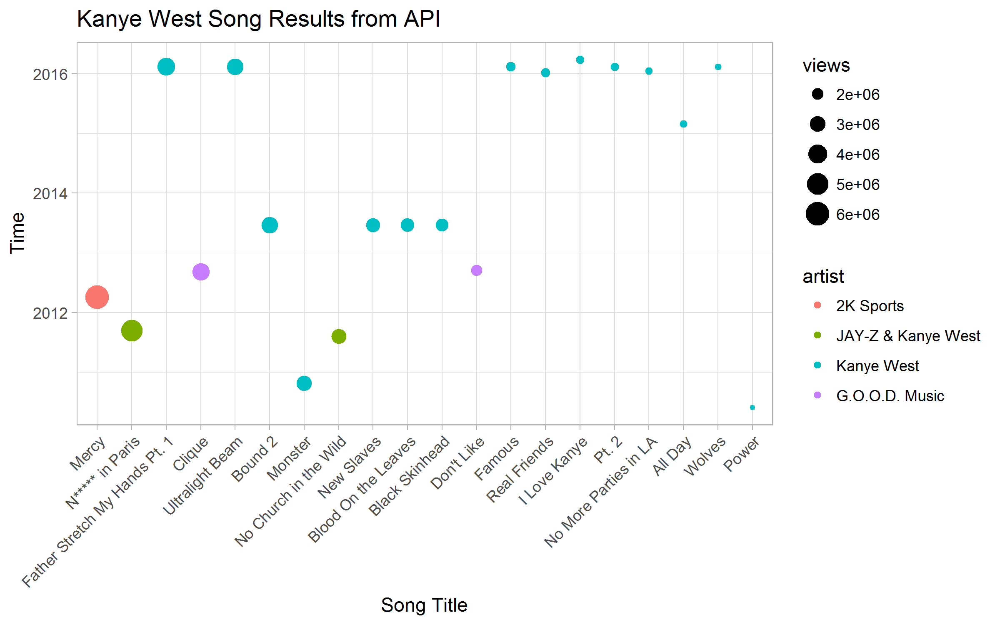

<h1 align="center">
  <br>


rGenius
<br>
</h1>

<h5 align="center">
Created by</a></h5>

<h4 align="center">

[Tyler Roberts](https://github.com/tylercroberts/)  •  [Maud Boucherit](https://github.com/MaudBoucherit)  •  [Duong Vu](https://github.com/DuongVu39) &nbsp;&nbsp;•  [Tariq Hassan](https://github.com/TariqAHassan) &nbsp;&nbsp;&nbsp;•  

</a></h4>

<br>
<h4 align="center">

<br>
<h4 align="center">

[](https://travis-ci.org/tylercroberts/rGenius)
[](https://codecov.io/github/tylercroberts/rGenius?branch=master)

[](https://opensource.org/licenses/MIT)

</a></h4>

<h1></h1>

<h4 align="center">
  <a href="#main-features">Main Features</a> &nbsp;&nbsp;&nbsp;•  <a href="#Usage">Usage</a> &nbsp;&nbsp;&nbsp;•  <a href="#Dependencies">Dependencies</a> &nbsp;&nbsp;&nbsp;•  <a href="#Installation">Installation</a> &nbsp;&nbsp;&nbsp;•&nbsp;&nbsp;

</h4>
<h1></h1>

<br>

## Overview

[Genius](http://genius.com/) is a website that allows users to provide annotations and interpretation of song lyrics, news stories, sources, poetry, and other documents.

This R package wraps the Genius API ([here](https://genius.com/)) and provides some interesting data extraction.





## Main Features

Below are some functions that has been developed in the package:

- `get_song()`: 

  - Search song by its ID number.
  - Return a dataframe including all information 

- `get_songs()`

  - Search several songs by their ID number
  - Return a dataframe including all information

- `search_song()`

  - Search song by its title.
  - Return a dataframe including all information about songs with the same title

- `get_artist()`

  - Search artist by his/her ID number
  - Return a dataframe including all information

- `get_song_from_artists()`

  - Search all songs by a specified artist by his/her name

  - Return a dataframe including all information

    ​


## Usage

```
get_song_from_artists("kanye", access_token, 6)
```

|      | id      | title                         | artist             |
| ---- | ------- | ----------------------------- | ------------------ |
| 1    | 70324   | Mercy                         | 2K Sports          |
| 2    | 51899   | Niggas in Paris               | JAY-Z & Kanye West |
| 3    | 2412669 | Father Stretch My Hands Pt. 1 | Kanye West         |
| 4    | 87225   | Clique                        | G.O.O.D. Music     |
| 5    | 2413549 | Ultralight Beam               | Kanye West         |
| 6    | 158615  | Bound 2                       | Kanye West         |


## Dependencies

- [R](https://cran.r-project.org/) >= 3.4.3
- [dplyr](https://dplyr.tidyverse.org/): grammar of data manipulation
- [httr](https://github.com/r-lib/httr): a friendly http package for R 
- [readr](https://github.com/tidyverse/readr): Read flat files (csv, tsv, fwf) into R
- [glue](https://github.com/tidyverse/glue): Glue strings to data in R. 


## Installation from sources

To install the package, simply type the code below in the console:

```R
devtools::load_all()
devtools::install_github("tylercroberts/rGenius")
```


## Contributing to rGenius 

All contributions, bug reports, bug fixes, documentation improvements, enhancements and ideas are welcome.

A detailed overview on how to contribute can be found in the [**contributing guide.**](https://github.com/tylercroberts/rGenius/blob/master/CONTRIBUTING.md)

If you are simply looking to start working with the [rGenius](https://github.com/tylercroberts/rGenius), navigate to the [GitHub “issues” tab](https://github.com/tylercroberts/rGenius/issues) and start looking through any issues.

Or maybe through using [rGenius](https://github.com/tylercroberts/rGenius) you have an idea of your own or are looking for something in the documentation and thinking ‘this can be improved’...you can do something about it!


