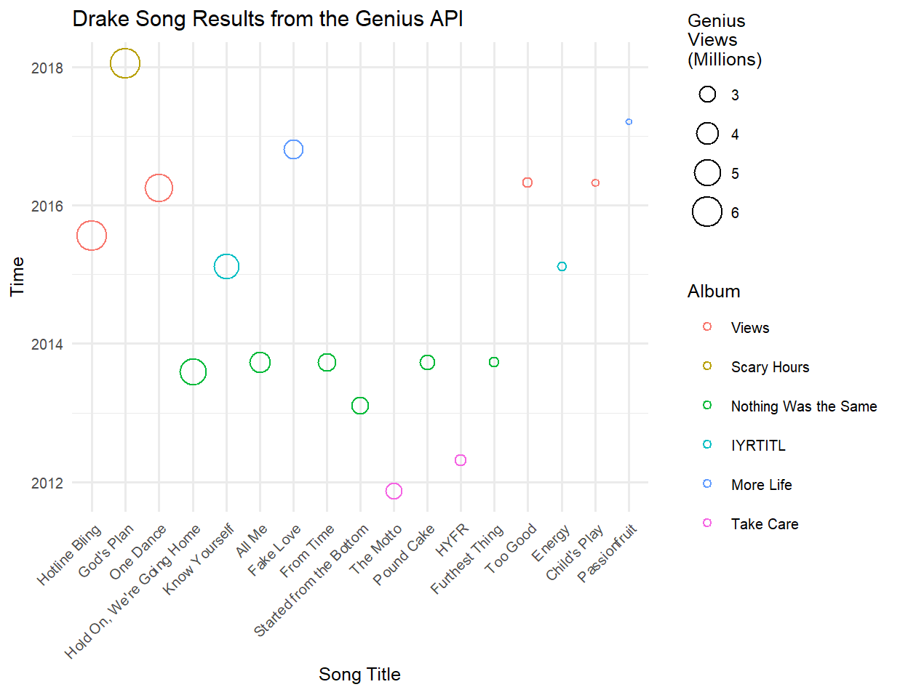
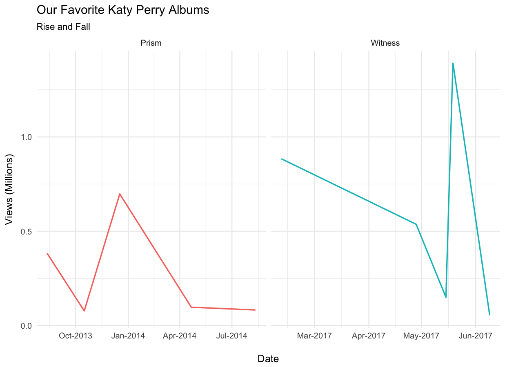

<h1 align="center">
  <br>


rGenius
<br>
</h1>

<h5 align="center"><a>
Created by</a></h5>

<h4 align="center"><a>

[Tyler Roberts](https://github.com/tylercroberts/) • [Maud Boucherit](https://github.com/MaudBoucherit) • [Duong Vu](https://github.com/DuongVu39) • [Tariq Hassan](https://github.com/TariqAHassan).

</a></h4>

<h4 align="center"><a>

[](https://travis-ci.org/tylercroberts/rGenius)
[](https://codecov.io/github/tylercroberts/rGenius?branch=master)

[](https://cran.r-project.org/)
[](https://opensource.org/licenses/MIT)

</a></h4>

<h1></h1>

## Overview

[Genius](http://genius.com/) is a website that allows users to provide annotations and interpretation of song lyrics, news stories, sources, poetry, and other documents.

This R package wraps the Genius API ([here](https://genius.com/)) and provides some interesting data extraction.

### Some examples of the package usage:

Popularity of some Drake songs:   



Popularity of Katy Perry's albums over time:   



Number of contributors to the lyrics by number of views for some rock songs:
   


Code for these above plots could be found in the [`/examples`](https://github.com/tylercroberts/rGenius/tree/master/examples) folder.

## Main Features

Below are some functions that has been developed in the package:

- `get_song()`:

  - Search song by its ID number.
  - Return a dataframe including all information

- `get_songs()`

  - Search several songs by their ID number
  - Return a dataframe including all information

- `search_song()`

  - Search song by its title.
  - Return a dataframe including all information about songs with the same title

- `get_artist()`

  - Search artist by his/her ID number
  - Return a dataframe including all information

- `get_song_from_artists()`

  - Search all songs by a specified artist by his/her name

  - Return a dataframe including all information

## Usage Example

```r
elton <- get_song_from_artists("elton", access_token=YOUR_ACCESS_TOKEN, n_per_page=6)
elton %>% 
    select(title, artist, date, views, album) %>% 
    head()
```

|      | title                                    | artist     | date       | views  | album                                    |
| ---- | ---------------------------------------- | ---------- | ---------- | ------ | ---------------------------------------- |
| 1    | Bennie and the Jets                      | Elton John | 1974-02-04 | 106362 | Goodbye Yellow Brick Road                |
| 2    | Rocket Man (I Think It's Going to Be a Long, Long Time) | Elton John | 1972-04-14 | 140622 | Honky Château                            |
| 3    | Tiny Dancer                              | Elton John | 1972-02-07 | 100702 | Madman Across the Water                  |
| 4    | Goodbye Yellow Brick Road                | Elton John | 1973-10-05 | 52378  | Goodbye Yellow Brick Road                |
| 5    | Can You Feel the Love Tonight (End Title) | Elton John | 1994-05-12 | 46823  | Rocket Man - The Definitive Hits (Australian Tour Edition 2011) |
| 6    | Elton John                               | NA         | 2017-12-01 | 32719  | NA                                       |

For more, see the examples and/or the vignettes directory.

## Installation from Source

To install the package, simply type the code below in the console:

```r
devtools::load_all()
devtools::install_github("tylercroberts/rGenius")
```

## API Key

To get an access token to the Genius API, go to this link: [genius.com/api-clients/new](https://genius.com/api-clients/new), and fill out the form. You only need to provide the name of your app and an app website (the app website can even be https://example.com). After saving, you can get the access token by clicking on "Generate Access Token". 

## Dependencies

- [R](https://cran.r-project.org/) >= 3.4.3
- [dplyr](https://dplyr.tidyverse.org/): grammar of data manipulation
- [httr](https://github.com/r-lib/httr): a friendly http package for R
- [readr](https://github.com/tidyverse/readr): Read flat files (csv, tsv, fwf) into R
- [glue](https://github.com/tidyverse/glue): Glue strings to data in R.

## Getting Started

To get started, we encourage you to review our vignette, located in [/vignettes](/vignettes).
Our code has also been extensively documented, so, as with any other package, you can learn more
about a `rGenius` function by simply entering `?func` in your R console, e.g., `?get_song`.

## Contributing to rGenius

All contributions, bug reports, bug fixes, documentation improvements, enhancements and ideas are welcome.

A detailed overview on how to contribute can be found in the [**contributing guide.**](https://github.com/tylercroberts/rGenius/blob/master/CONTRIBUTING.md)

If you are simply looking to start working with the [rGenius](https://github.com/tylercroberts/rGenius), navigate to the [GitHub “issues” tab](https://github.com/tylercroberts/rGenius/issues) and start looking through any issues.

Or maybe through using [rGenius](https://github.com/tylercroberts/rGenius) you have an idea of your own or are looking for something in the documentation and thinking ‘this can be improved’...you can do something about it!
